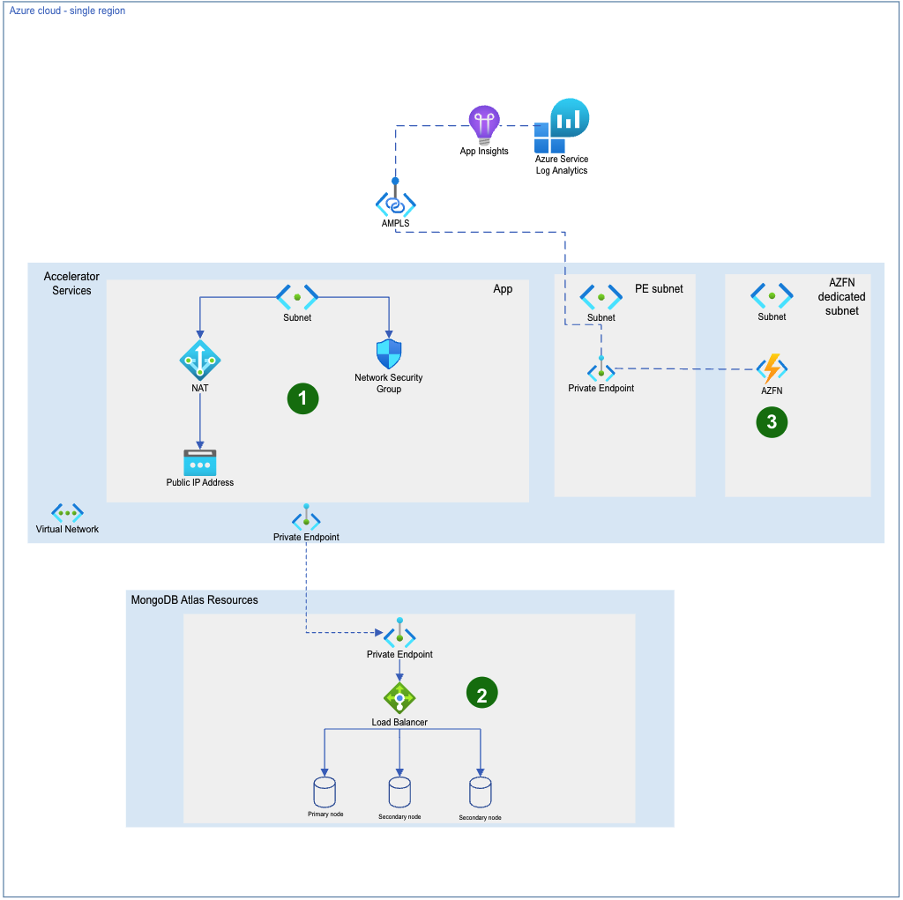
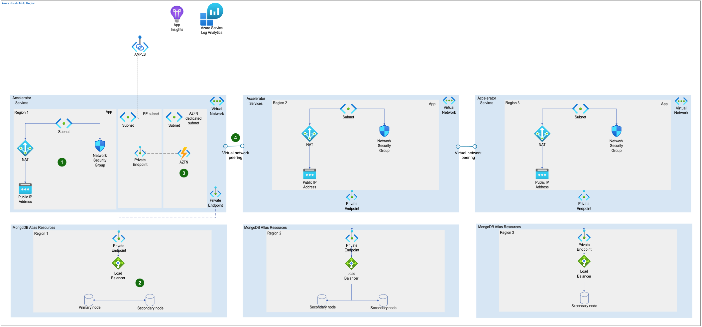

# Baseline MongoDB Atlas Reference Architecture in an Azure Landing Zone

> [!IMPORTANT]
> The [Terraform Landing Zone for MongoDB Atlas on Azure](https://github.com/mongodb-partners/Azure-MongoDB-Atlas-Landing-Zone) assumes that you already successfully implemented an Azure landing zone. However, you can use the Terraform Landing Zone for MongoDB Atlas on Azure if your infrastructure doesn't conform to Azure landing zones. For more information, refer to [Cloud Adoption Framework enterprise-scale landing zones](https://learn.microsoft.com/en-us/azure/cloud-adoption-framework/ready/enterprise-scale/).

## Overview

This document presents a baseline reference architecture for deploying MongoDB Atlas in an Azure landing zone. The solution demonstrates how to establish secure, private connectivity between Azure resources and MongoDB Atlas clusters, while following Azure landing zone principles for governance, network segmentation, and automation.

By leveraging managed cloud services and Azure-native networking, this architecture provides a foundation for scalable, resilient, and secure application data workloads across both single-region and multi-region scenarios.

---

## Architecture

The MongoDB Atlas Azure landing zone accelerator supports two deployment patterns, each designed to address different requirements for availability, resilience, and operational complexity:

### Single-Region Architecture

In the single-region deployment, all core components—including the MongoDB Atlas cluster, Azure Virtual Network, monitoring, and supporting application infrastructure—are provisioned within a single Azure region. This setup is ideal for applications with regional data residency requirements or when resilience to regional failure is not a primary concern.

#### Architecture Diagram

#### Workflow

The following steps describe the end-to-end workflow for the single-region scenario. Each step corresponds to a numbered element in the architecture diagram:

1. **Application or Service**: Applications or services, are deployed in the subnet with the NSG and the NAT so that they are secured and have visibility to the MongoDB Atlas clusters. These can include web apps, backend services, analytics jobs, or integration tools.
2. **MongoDB Atlas Cluster**: The MongoDB Atlas clusers are visible through a private endpoint connection and can connect to the applications or services deployed in the secured Virtual Network.
3. **Observability**: An Azure Function App periodically queries the MongoDB Atlas API to gather database health and performance metrics, which are visualized in Application Insights dashboards.

This tightly integrated, private architecture ensures data security, minimizes latency for regional applications, and streamlines management for IT teams.

Please read [this MongoDB Atlas article](https://www.mongodb.com/docs/atlas/architecture/current/deployment-paradigms/single-region/) for more detailed information on single region architecture.

### Multi-Region Architecture

For organizations with higher requirements for business continuity and disaster recovery, the multi-region architecture distributes MongoDB Atlas cluster nodes and supporting infrastructure across multiple Azure regions. The design leverages VNet peering and multiple private endpoints to provide seamless, secure connectivity, even in the event of a regional failure.

#### Architecture Diagram

#### Workflow

The following steps outline the multi-region scenario, with numbering matching the architecture diagram:

1. **Application or Service**: Applications or services, are deployed in the subnet with the NSG and the NAT so that they are secured and have visibility to the MongoDB Atlas clusters. These can include web apps, backend services, analytics jobs, or integration tools.
2. **MongoDB Atlas Cluster**: The MongoDB Atlas clusers are visible through a private endpoint connection and can connect to the applications or services deployed in the secured Virtual Network.
3. **Observability**: An Azure Function App periodically queries the MongoDB Atlas API to gather database health and performance metrics, which are visualized in Application Insights dashboards.
4. **Resiliency**: VNet Peering is enabled so that in case of a regional outage, all remaining regions have visibility to the rest of the MongoDB Atlas clusters.

This architecture enables organizations to deliver highly available, resilient services, meeting the most demanding business and compliance requirements.

Please read [this MongoDB Atlas article](https://www.mongodb.com/docs/atlas/architecture/current/deployment-paradigms/multi-region/#5-node--3-region-architecture--2-2-1-) for more detailed information on 5-Node, 3-Region Architecture (2+2+1).

---

## Components

The architecture brings together several core components to deliver security, scalability, and operational excellence:

- **MongoDB Atlas (Managed Service)**: Provides managed database clusters with automated backups, high availability, and optional multi-region deployment. Atlas role-based access control (RBAC) ensures fine-grained data security.
- **Azure Virtual Networks and Private Endpoints**: Ensure all communications between Azure resources and MongoDB Atlas are private and encrypted, never traversing the public internet.
- **Network Security Groups (NSGs) and NAT Gateways**: Enforce network segmentation and secure outbound connectivity.
- **Observability**: Azure Application Insights and Function Apps provide centralized monitoring and operational visibility.
- **Infrastructure Automation**: Terraform modules and GitHub Actions enable infrastructure as code, automation, and repeatable deployments.

---

## Alternatives

When considering the deployment of MongoDB Atlas in Azure, several alternative database services and deployment patterns may be evaluated based on organizational requirements, technical constraints, and existing skill sets:

- [Azure Cosmos DB](https://learn.microsoft.com/en-us/azure/cosmos-db/introduction) is a fully managed, globally distributed NoSQL database service that supports multiple APIs, including MongoDB API compatibility. While Cosmos DB offers high availability and low latency, it may not provide complete parity with all MongoDB Atlas features. Organizations seeking a fully Azure-native solution with API-level compatibility may consider Cosmos DB, but should review functional differences and potential migration impacts.

- **Self-Managed MongoDB on Azure Virtual Machines**: Organizations may choose to deploy and manage MongoDB clusters directly on Azure infrastructure using virtual machines. While this approach offers maximum control, it increases operational overhead and places responsibility for maintenance, scaling, backups, and security on the organization.

- **Other Cloud-Hosted MongoDB Providers**: Some organizations may evaluate other MongoDB hosting solutions or multi-cloud strategies to meet specific regulatory, operational, or business requirements.

Each alternative has its own trade-offs in terms of cost, operational complexity, skill requirements, and feature set. Carefully assess your scenario, data architecture, and operational goals before selecting a solution.

For more information about MongoDB Atlas and its [use cases](https://www.mongodb.com/solutions/use-cases), refer to the [MongoDB Atlas documentation](https://www.mongodb.com/docs/atlas/).

## Security

Security provides assurances against deliberate attacks and the abuse of your valuable data and systems. For more information, see [Design review checklist for Security](https://learn.microsoft.com/en-us/azure/well-architected/security/checklist).

Most databases store sensitive data. Implementing security only at the database level isn't enough to secure the architecture where you deploy these workloads. Defense in-depth is a comprehensive approach to security that implements multiple layers of defense mechanisms to protect data. Instead of relying on a single security measure at a specific level, such as focusing only on network security mechanisms, the defense in-depth strategy uses a combination of different layer security measures to create a robust security posture. You can architect the defense in-depth approach for MongoDB Atlas workloads by using hardened network security with private endpoints and VNet peering from the Azure infrastructure side. For detailed information about MongoDB Atlas security features, see [MongoDB Atlas Security](https://www.mongodb.com/docs/atlas/setup-cluster-security/).

The Azure infrastructure hosting applications that connect to MongoDB Atlas must be secured against unauthorized access. In this landing zone accelerator, MongoDB Atlas connectivity is established through private endpoints, which provide the following security benefits:

- **Private connectivity**: Traffic between Azure resources and MongoDB Atlas never traverses the public internet.
- **Network isolation**: Private endpoints are deployed within your Azure VNet, providing network-level isolation

When implementing VNet peering for MongoDB Atlas connectivity, consider the following security practices:

- **Hub-and-spoke topology**: Implement a hub-and-spoke network topology with centralized security controls in the hub VNet.
- **Least privilege access**: Configure VNet peering with minimal required permissions and disable unnecessary features like gateway transit when not needed.
- **Network segmentation**: Implement proper network segmentation to isolate different workloads and environments.

> We recommend evaluating whether additional Microsoft security services beyond those listed, e.g Azure Firewall, Defender for DDoS, Defender for Cloud, Microsoft Entra, and Azure Key Vault - are appropriate for your environment. Depending on your architecture and threat model, you may also want to consider among other options:
>
> - [Azure Web Application Firewall (WAF)](https://learn.microsoft.com/en-us/azure/web-application-firewall/overview)
> - [Defender for App Service](https://learn.microsoft.com/en-us/azure/defender-for-cloud/defender-for-app-service-introduction)
> - [Defender for Servers](https://learn.microsoft.com/en-us/azure/defender-for-cloud/defender-for-servers-overview)
> - [Microsoft Entra Global Secure Access (GSA)](https://learn.microsoft.com/en-us/entra/global-secure-access/overview-what-is-global-secure-access)

**Note**: Azure Key Vault or Atlas secrets management can be integrated to secure application credentials.

---

## Operational Considerations

### Backup and Recovery

- MongoDB Atlas automated backup policies ensure that data can be restored to any point in time, within retention limits.
- Operational runbooks should include regular backup testing and validation.

### Cost Optimization

Cost tracking requires careful monitoring across multiple subscription architectures because MongoDB Atlas billing consolidates under the primary subscription. Understand cost allocation patterns and use appropriate tools for comprehensive expense tracking.

Use Microsoft Cost Management tools to track overall Azure expenses across all subscriptions:

- **Review costs regularly by using Cost Management tools.** These tools provide insights into overall Azure expenses and track resource usage patterns across your MongoDB Atlas deployment.

- **Understand billing consolidation.** Charges related to MongoDB Atlas resources in the primary subscription consolidate under that subscription. Individual per-subscription billing details aren't itemized in Azure for MongoDB Atlas resources.

- **Track independent charges through MongoDB Atlas.** For detailed cost tracking and invoicing specific to MongoDB Atlas usage, refer to MongoDB Atlas cost management tools and reports.

- **Cluster sizing is based on observed workload metrics** with reserved capacity available for predictable workloads. For more information related to Cluster configuration costs, check [this document](https://www.mongodb.com/docs/atlas/billing/cluster-configuration-costs/) in the MongoDB Atlas site.

---

## Monitoring

Monitoring is a critical part of any production-level solution. Support Azure solutions with a [monitoring strategy](https://learn.microsoft.com/en-us/azure/cloud-adoption-framework/strategy/monitoring-strategy) as part of the end-to-end [observability](https://learn.microsoft.com/en-us/azure/cloud-adoption-framework/manage/monitor/observability) strategy.

The *Landing Zone for MongoDB Atlas on Azure* does not deploy or configure monitoring solutions for MongoDB Atlas on Azure. Users are responsible for implementing these practices based on their specific requirements.

Use Atlas to monitor:

- **Metrics**
- **Real-Time Performance Panel**
- **Namespace Insights**
- **Query Profiler**
- **Performance Advisor**
- **Billing Cost Explorer**

References for metrics: [How to Monitor MongoDB and What Metrics to Monitor](https://www.mongodb.com/resources/products/capabilities/how-to-monitor-mongodb-and-what-metrics-to-monitor).

Configure **Project Alerts** to notify on metric drift from your baseline (e.g., rising query targeting, any scan-and-order, or normalized CPU sustained >70% or <40%). Docs: [Monitoring and Alerts](https://www.mongodb.com/docs/atlas/monitoring-alerts/).

**Note:** Azure Monitor cannot read Atlas metrics directly. Use Atlas UI/API/webhooks or supported integrations to ingest them.

---

## Next Steps

To deploy this architecture, follow the step-by-step instructions and Terraform automation in the [MongoDB Atlas Azure Landing Zone Accelerator repository](https://github.com/mongodb-partners/Azure-MongoDB-Atlas-Landing-Zone). Review Azure landing zone documentation to ensure your environment meets governance and security best practices.