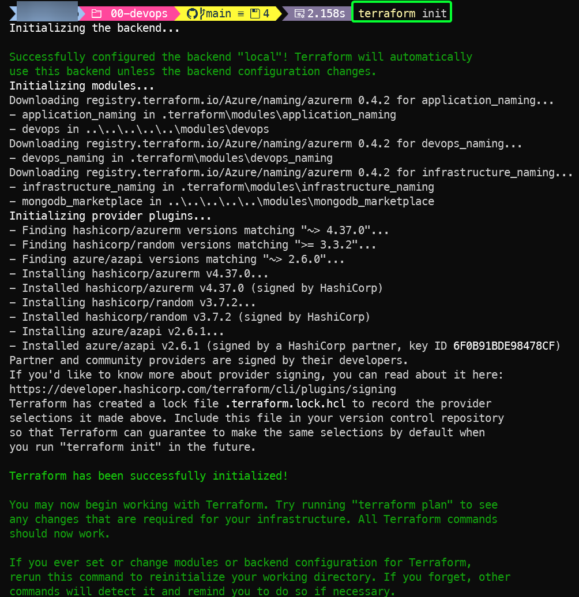
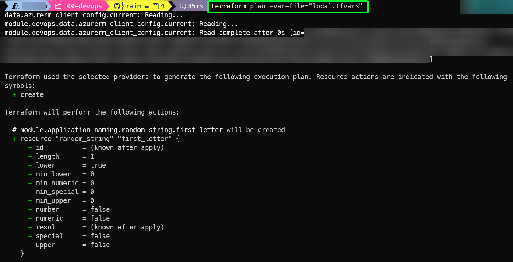
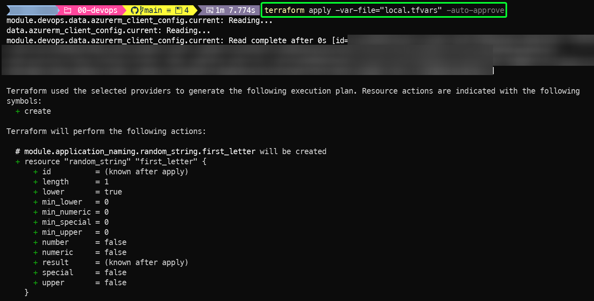

# Manual Steps for Applying Terraform Resources

> **Note:** The following instructions cover both single-region and multi-region deployments. Be sure to use the correct folder paths for your scenario:
>
> - **Single-region:** `templates/single-region/envs/dev/`
> - **Multi-region:** `templates/multi-region/envs/dev/`

This guide provides a clear, step-by-step process for deploying infrastructure and applications manually using Terraform. Follow the steps in order; each depends on the outputs of the previous step.

> **Note:** Step 00 (DevOps) is always mandatory and must be run manually before continuing with any other part of the deployment, regardless of whether you use manual steps or the pipeline for later steps.

---

## Table of Contents

- [Overview: Deployment Sequence](#overview-deployment-sequence)
- [Step 00: DevOps (Mandatory, Always Manual) and Marketplace](#step-00-devops-mandatory-always-manual-and-marketplace)
- [Step 01: Base Infrastructure](#step-01-base-infrastructure)
- [Step 02: Application](#step-02-application)
- [Quick Checklist for Local Manual Runs](#quick-checklist-for-local-manual-runs)
- [Provision an already created Terraform backend](#provision-an-already-created-terraform-backend)
- [Provision already created Resource Groups](#provision-already-created-resource-groups)

## Overview: Deployment Sequence

**You must perform the steps in this order. For each step, use the appropriate path for your deployment type:**

| Step | Single-Region Path | Multi-Region Path |
|------|-------------------|------------------|
| 00: DevOps | `templates/single-region/envs/dev/00-devops/` | `templates/multi-region/envs/dev/00-devops/` |
| 01: Base Infrastructure | `templates/single-region/envs/dev/01-base-infra/` | `templates/multi-region/envs/dev/01-base-infra/` |
| 02: Application | `templates/single-region/envs/dev/02-app-resources/` | `templates/multi-region/envs/dev/02-app-resources/` |

1. **Step 00: DevOps (Mandatory, Always Manual)**
   - Sets up the Terraform backend and core identity.
   - Migrates the local state to a storage account to handle the terraform state in the cloud
   - Optionally, creates the MongoDB Atlas Organization (via Marketplace).
   - Outputs are required for all subsequent steps.
   - **Navigate to the correct path for your deployment type before running this step.**

2. **Step 01: Base Infrastructure**
   - Provisions networking, NAT, subnets, and configures MongoDB Atlas (project, cluster, PrivateLink).
   - For multi-region deployments: Also provisions VNet peering connections between regions.
   - Can be run manually or via the pipeline.
   - **Navigate to the correct path for your deployment type before running this step.**

3. **Step 02: Application (optional)**
   - This step deploys the infrastructure for the Test Database Connection app that makes a test connection with the cluster deployed in the step 1.
   - Deploys application infrastructure: App Service Plan, subnet, and an empty Azure Web App with VNet integration.
   - Does not deploy the Test Database Connection app code. For instructions on deploying and testing the Test Database app Connection app, see [Test_DB_connection_steps.md](Test_DB_connection_steps.md).
   - Can be run manually or via the pipeline.
   - **Navigate to the correct path for your deployment type before running this step.**

---

## Step 00: DevOps (Mandatory, Always Manual) and Marketplace

### MongoDB Atlas Organization Setup (Optional in Step 00)

You can choose whether to have Terraform create a MongoDB Atlas Organization for you via the Azure Marketplace, or use an existing Atlas Organization.

#### Option 1: Create Atlas Org via Terraform (Marketplace Module)

To create a new MongoDB Atlas Organization via Terraform, set `should_create_mongo_org = true` and fill in all other required variables (see `local.tfvars.template` for reference).

#### Option 2: Use an Existing Atlas Org

To use an existing MongoDB Atlas Organization, set `should_create_mongo_org = false`. You must also set your Atlas API keys for your existing organization as environment variables (see [Setup-environment.md](Setup-environment.md)).

---

### Running Step 00

**Preparation:**

Before running this step, review and follow the instructions in [Setup-environment.md](Setup-environment.md) to ensure all required environment variables and configuration values are set correctly for your deployment.

Navigate to `envs/dev/00-devops/` and run:

```bash
terraform init
terraform plan -var-file="local.tfvars"
# Review the plan output carefully
terraform apply -var-file="local.tfvars" -auto-approve
```

_terraform init output example_


_terraform plan output example_


_terraform apply output example_


#### Migrate the Terraform state to the newly created storage account

After deploying the resources with the local backend, migrate the state to the Azure backend to avoid losing track of the infrastructure.

The steps to follow would be:

  1. Delete the local backend block in the `terraform.tf` file in the step 0
  1. Uncomment and update the azurerm backend block with the appropriate values
  1. Migrate the state to the Azure backend by running: `terraform init -migrate-state`
  1. Delete the local `terraform.tfstate` file

_terraform init -migrate-state output example_


**Important Notes:**

- **Run only once:** If you need to re-run this step with different parameters, you must manually destroy the previous resources first.
- **Backend Setup:** This step sets up the remote Terraform state and core identity for all remaining steps.
- **Copy outputs:** After applying, copy the outputs (`container_name`, `storage_account_name`, `resource_group_name`) for use in later steps.

Example outputs to copy:

```hcl
container_name         = "<from step 00 output>"
storage_account_name   = "<from step 00 output>"
resource_group_name    = "<from step 00 output>"
```

---

**MongoDB Atlas API Key Setup:**

If you created a new Atlas Organization in this step, go to the Atlas UI and follow the service account setup steps described in [MongoAtlasMetrics_deployment_steps.md](./MongoAtlasMetrics_deployment_steps.md) and generate API keys ([see MongoDB docs](https://www.mongodb.com/docs/atlas/configure-api-access-org/) for API key creation guidance).

Set your MongoDB Atlas API keys as environment variables as described in [Setup-environment.md](Setup-environment.md).

> **MongoDB Atlas API keys must always be set as environment variables before running step 01 where Atlas configuration is performed.**

## Step 01: Base Infrastructure

**Preparation:**

Before running this step, review and follow the instructions in [Setup-environment.md](Setup-environment.md) to ensure all required environment variables and configuration values are set correctly for your deployment.

- Go to `terraform.tf` in `envs/dev/01-base-infra/terraform.tf` and:
  - Replace:

  ```hcl
  backend "azurerm" {
    use_azuread_auth = true
  }
  ```

  with the following, using the outputs from Step 00:

  ```hcl
    backend "azurerm" {
      resource_group_name  = "<resource_group_name>"
      storage_account_name = "<storage_account_name>"
      container_name       = "<container_name>"
      key                  = "01-base-infra.tfstate"
    }
  ```

> **Tip:** You can use a different key name for your backend state file instead of the proposed `01-base-infra.tfstate`. Choose a naming convention that fits your environment or workflow.

### Update `data.tf` for Step 01

In Step 01, your `data.tf` references the remote state from Step 00 (`devops`).

All backend configuration values for accessing this remote state should be set using variables defined in `variables.tf` and supplied via `local.tfvars` or environment variables.

Navigate to `envs/dev/01-base-infra/` and run:

```bash
terraform init
terraform validate
terraform plan -var-file=local.tfvars -out tfplan
terraform apply -var-file=local.tfvars tfplan
```

This step provisions network resources, configures MongoDB Atlas (project, cluster, PrivateLink), and deploys observability resources. For multi-region deployments, it also creates VNet peering connections between regions.

Observability resources provision the infrastructure needed to host a Function App for MongoDB Atlas metrics collection, including Application Insights, storage, and networking. The actual metrics function code (which connects to the MongoDB Atlas API, retrieves key metrics, and pushes them to Application Insights) must be deployed separately after the infrastructure is provisioned. This enables centralized monitoring, alerting, and analysis of your MongoDB Atlas environment directly within Azure. For more information on how to deploy the metrics function, please review the [Mongo Atlas Metrics Deployment guide](./MongoAtlasMetrics_deployment_steps.md).

---

## Step 02: Application

**Preparation:**

Before running this step, review and follow the instructions in [Setup-environment.md](Setup-environment.md) to ensure all required environment variables and configuration values are set correctly for your deployment.

- Go to `terraform.tf` in `envs/dev/02-app-resources/terraform.tf` and replace:

  ```hcl
  backend "azurerm" {
    use_azuread_auth = true
  }
  ```

  with the following, using the outputs from Step 00:

  ```hcl
  backend "azurerm" {
      resource_group_name  = "<resource_group_name>"
      storage_account_name = "<storage_account_name>"
      container_name       = "<container_name>"
      key                  = "02-application.tfstate"
  }
  ```

> **Tip:** You can use a different key name for your backend state file instead of the proposed `02-application.tfstate`. Choose a naming convention that fits your environment or workflow.

### Data Configuration

### Remote State and Variable Usage

In Step 02, your `data.tf` references two remote states:

- `common` (Step 01: Base Infrastructure)
- `devops` (Step 00: DevOps)

All backend values for these remote states are set using variables defined in `variables.tf` and provided via `local.tfvars` or environment variables.

Navigate to `envs/dev/02-app-resources/` and run:

```bash
terraform init
terraform plan -var-file="local.tfvars"
terraform apply -var-file="local.tfvars" -auto-approve
```

This deploys application resources (App Service, test app, VNet integration).

**Note:** To deploy the Test Database App into the Web App resource deployed in this step, please follow [Test_DB_connection_steps](Test_DB_connection_steps.md).

---

## Quick Checklist for Local Manual Runs

1. **Step 00: DevOps (Manual)**
   - Decide whether to create a new Atlas Organization or use an existing one (see options above).
   - Navigate to the appropriate path:
     - Single-region: `templates/single-region/envs/dev/00-devops/`
     - Multi-region: `templates/multi-region/envs/dev/00-devops/`
   - Set variable values using a `local.tfvars` file or environment variables.
   - Run Terraform commands.
   - Copy outputs for backend configuration.
   - **Note:** Step 00 deploys the resource group used by Step 01 and Step 02. If you do not provide a resource group name, it will not be created automatically: ensure you pass the correct value if you want it provisioned.

2. **Step 01: Base Infrastructure**
   - Navigate to the appropriate path:
     - Single-region: `templates/single-region/envs/dev/01-base-infra/`
     - Multi-region: `templates/multi-region/envs/dev/01-base-infra/`
   - Update `terraform.tf` with backend values from Step 00.
   - Set environment variables and API keys (see [Setup-environment.md](Setup-environment.md)).
   - Run Terraform commands.
   - This step also deploys observability resources (Application Insights, Storage Account, Service Plan, etc.).

3. **Step 02: Application**
   - Navigate to the appropriate path:
     - Single-region: `templates/single-region/envs/dev/02-app-resources/`
     - Multi-region: `templates/multi-region/envs/dev/02-app-resources/`
   - Update `terraform.tf` with backend values from Step 00.
   - Ensure `data.tf` references Step 01 outputs using the `terraform_remote_state` configuration.
   - Run Terraform commands.

## Provision an already created Terraform backend

You still need to follow the steps in [Step 00: DevOps (Mandatory, Always Manual) and Marketplace](#step-00-devops-mandatory-always-manual-and-marketplace). However, **first** you need to follow these instructions:

- Remove the `backend local` block:

  ``` hcl
    backend "local" {}
  ```

- Uncomment and update the `backend azurerm` block with the appropiate values of the existing Terraform backend:

  ``` hcl
    backend "azurerm" {
      resource_group_name  = "{rg-name-of-existing-backend}"
      storage_account_name = "{sa-name-of-existing-backend}"
      container_name       = "{container-devops-name-of-existing-backend}"
      key                  = "devops.tfstate"
    }
  ```

- In `modules/devops/main.tf`, delete the following resources:

  ``` hcl
  resource "azurerm_storage_account" "sa" {
    name                            = var.storage_account_name
    resource_group_name             = azurerm_resource_group.devops_rg.name
    location                        = var.location
    account_tier                    = var.account_tier
    account_replication_type        = var.replication_type
    tags                            = var.tags
    min_tls_version                 = "TLS1_2"
    allow_nested_items_to_be_public = false
    blob_properties {
      delete_retention_policy {
        days = 7
      }

      versioning_enabled = true
    }

    infrastructure_encryption_enabled = true
  }

  resource "azurerm_storage_container" "container" {
    name                  = var.container_name
    storage_account_id    = azurerm_storage_account.sa.id
    container_access_type = var.container_access_type
  }
  ```

- In `modules/devops/root_identity.tf`, delete the following resource:

  ``` hcl
  resource "azurerm_role_assignment" "blob_data_contributor" {
    scope                = azurerm_storage_account.sa.id
    role_definition_name = "Storage Blob Data Contributor"
    principal_id         = azurerm_user_assigned_identity.identity.principal_id
  }
  ```

- Delete all references to the storage account and storage account container in the devops module and in the step 0 (variables and outputs).

- If you want to use the pipeline, **the pipeline needs permissions over the resource group and the storage account where your Terraform backend is stored**. So, you need to add a role assignment to the Managed Identity created in `modules/devops/root_identity.tf` over the storage account:

  ``` hcl
  data "azurerm_storage_account" "sa_information" {
    name                = "{name-of-storage-account-where-the-terraform-backend-is-stored}"
    resource_group_name = "{name-of-resource-group-where-the-terraform-backend-is-stored}"
  }

  data "azurerm_resource_group" "rg_information" {
    name = "{name-of-resource-group-where-the-terraform-backend-is-stored}"
  }

  resource "azurerm_role_assignment" "terraform_backend_permission" {
    scope                = data.azurerm_storage_account.sa_information.id
    role_definition_name = "Storage Blob Data Contributor"
    principal_id         = azurerm_user_assigned_identity.identity.principal_id
  }

  resource "azurerm_role_assignment" "terraform_backend_rg_permission" {
    scope                = data.azurerm_resource_group.rg_information.id
    role_definition_name = "Contributor"
    principal_id         = azurerm_user_assigned_identity.identity.principal_id
  }
  ```

**Notes:**
- Skip the steps of `Migrate the Terraform state to the newly created storage account` since the Terraform state will be in the cloud automatically.

- All resources should be under the same Azure subscription.

- If you run the step 01 and/or 02 manually, you'll need to point the `terraform.tf` files for those steps to the same Terraform backend configuration provided in the step 0.

- When following the [Setup-environment.md](Setup-environment.md) guide to set the Pipeline variables, the values for the variables `TF_VAR_resource_group_name_tfstate`, `TF_VAR_storage_account_name_tfstate`,`TF_VAR_container_name_tfstate` will be the same you used as Terraform backend in step 0.

## Provision already created Resource Groups

You still need to follow the steps in [Step 00: DevOps (Mandatory, Always Manual) and Marketplace](#step-00-devops-mandatory-always-manual-and-marketplace). However, **first** you need to follow these instructions:

- Set the names of the existing resource groups as parameters for the `devops` module in `templates/{single region or multi region}/envs/{environment}/00-devops/main.tf`:

  ```hcl
    resource_group_name_devops         = "{rg-name-to-handle-step00-resources}"
    resource_group_name_infrastructure = "{rg-name-to-handle-step01-resources}"
    resource_group_name_app            = "{rg-name-to-handle-step02-resources}"
  ```

- In `modules/devops/main.tf` delete the following resources:

  ``` hcl
  resource "azurerm_resource_group" "devops_rg" {
    name     = var.resource_group_name_devops
    location = var.location
    tags     = var.tags
  }

  resource "azurerm_resource_group" "infrastructure_rg" {
    name     = var.resource_group_name_infrastructure
    location = var.location
    tags     = var.tags
  }

  resource "azurerm_resource_group" "application_rg" {
    count    = length(var.resource_group_name_app) > 0 ? 1 : 0
    name     = var.resource_group_name_app
    location = var.location
    tags     = var.tags
  }
  ```

- In the `modules/devops/main.tf` you'll need to add:

  ``` hcl
  data "azurerm_resource_group" "devops" {
    name = var.resource_group_name_devops
  }

  data "azurerm_resource_group" "infra" {
    name = var.resource_group_name_infrastructure
  }

  data "azurerm_resource_group" "app" {
    name = var.resource_group_name_app
  }
  ```

- Update the references from the deleted resource group blocks and add the references to the data blocks (in the devops module)

  `root_identity.tf`:

  ``` hcl
  resource "azurerm_user_assigned_identity" "identity" {
    location            = var.location
    name                = "root-identity"
    resource_group_name = data.azurerm_resource_group.devops.name
  }

  resource "azurerm_federated_identity_credential" "federated_identity" {
    name                = var.federation.federated_identity_name
    subject             = var.federation.subject
    audience            = var.audiences
    issuer              = var.issuer
    resource_group_name = data.azurerm_resource_group.devops.name
    parent_id           = azurerm_user_assigned_identity.identity.id
  }

  locals {
    permissions_to_create = [
      data.azurerm_resource_group.devops,
      data.azurerm_resource_group.infra
    ]
  }

  resource "azurerm_role_assignment" "optional_permission" {
    scope                = data.azurerm_resource_group.app.id
    role_definition_name = "Contributor"
    principal_id         = azurerm_user_assigned_identity.identity.principal_id
  }
  ```

  `main.tf`:
  ``` hcl
  resource "azurerm_storage_account" "sa" {
    name                            = var.storage_account_name
    resource_group_name             = data.azurerm_resource_group.devops.name
    location                        = var.location
    account_tier                    = var.account_tier
    account_replication_type        = var.replication_type
    tags                            = var.tags
    min_tls_version                 = "TLS1_2"
    allow_nested_items_to_be_public = false
    blob_properties {
      delete_retention_policy {
        days = 7
      }

      versioning_enabled = true
    }

    infrastructure_encryption_enabled = true
  }
  ```

  `outputs.tf`:

  ```hcl
  output "identity_info" {
    value = {
      tenant_id                        = data.azurerm_client_config.current.tenant_id
      subscription_id                  = data.azurerm_client_config.current.subscription_id
      client_id                        = azurerm_user_assigned_identity.identity.client_id
      devops_resource_group_id         = data.azurerm_resource_group.devops.id
      infrastructure_resource_group_id = data.azurerm_resource_group.infra.id
      application_resource_group_id    = length(var.resource_group_name_app) > 0 ? data.azurerm_resource_group.app.id : null
      state_storage_name               = azurerm_storage_account.sa.name
      state_container_name             = azurerm_storage_container.container.name
      storage_account_id               = azurerm_storage_account.sa.id
    }
  }
  ```

**Notes:**

- In these examples we are showing how to use 3 already created Resource Groups, but you can adjust it to add just 1 or 2 and create the rest through Terraform. Also, take in account that the creation of the resource group for the step 02 is optional.

---

**Tips:**

- Reference [Setup-environment.md](Setup-environment.md) for instructions on setting environment variables locally or in CI.
- Step 2 (Application) is optional and can be skipped if not needed.
- Do not rerun Step 00 unless you intend to destroy and recreate all resources.
