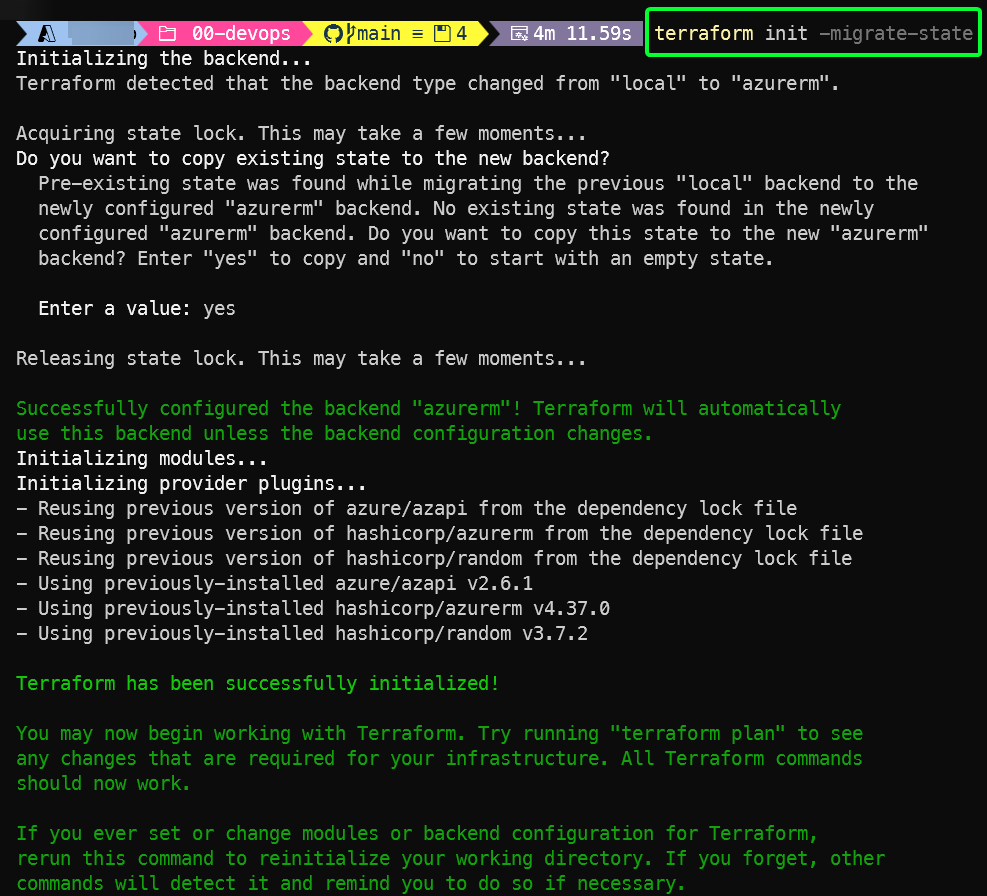

# Pipeline Deployment Guide

> **Note:** This repository provides two separate GitHub Actions pipelines for infrastructure deployment:
>
> - **Single-Region Pipeline:** `.github/workflows/ci-cd-infra-dev-single-region.yml`
> - **Multi-Region Pipeline:** `.github/workflows/ci-cd-infra-dev-multi-region.yml`
>
> Use the appropriate pipeline for your deployment scenario. The correct working directories and steps are handled automatically by each pipeline.

This guide explains how to deploy the infrastructure and application (optional) using the automated pipeline provided in this repository.

## Table of Contents

- [Overview](#overview)
- [Prerequisites](#prerequisites)
- [Pipeline Steps](#pipeline-steps)
- [Running the Pipeline](#running-the-pipeline)
- [Notes](#notes)

## Overview

The pipeline automates the sequential deployment of Terraform steps 01 and 02, ensuring resources are provisioned in the correct order and with the required dependencies.

## Prerequisites

- **Step 0: DevOps (Manual Only) — Run First**
  - You must always run step 00-devops manually in `envs/dev/00-devops/` inside the respective single-region or multi-region folder before using the pipeline.
  - This step produces outputs (such as resource group for all the steps, storage account, and optionally MongoDB Atlas org) that are required for configuring environment variables and subsequent steps.
  - Deploys:
    - Resource group for state and identity
    - Resource group for step 01
    - Resource group for step 02 (optional)
    - Storage account for Terraform remote state
    - Federated identity and permissions for automation
    - Optionally, MongoDB Atlas Organization via Azure Marketplace (if enabled)
  - The pipeline does not run this step.
- After running step 0, configure all required environment variables in your pipeline environment using the outputs from step 0. See [Setup-environment.md](Setup-environment.md) for details.
- You must also create a GitHub environment named `dev` in your repository settings. See the [Creating a GitHub Environment](https://docs.github.com/en/actions/how-tos/deploy/configure-and-manage-deployments/manage-environments#creating-an-environment) documentation for instructions.
- If you need help to run the step 0, please check the steps in the [Deploy with manual steps Guide](./Deploy-with-manual-steps.md).

### Migrate the Terraform state to the newly created storage account

After deploying the resources with the local backend, migrate the state to the Azure backend to avoid losing track of the infrastructure.

The steps to follow would be:

  1. Delete the local backend block in the `terraform.tf` file in the step 0
  1. Uncomment and update the azurerm backend block with the appropriate values
  1. Migrate the state to the Azure backend by running: `terraform init -migrate-state`
  1. Delete the local `terraform.tfstate` file

_terraform init -migrate-state output example_

## Pipeline Steps

1. **Environment Setup**
   - Configure all required environment variables in your pipeline environment using the outputs from step 0. See [Setup-environment.md](Setup-environment.md) for details.

2. **Base Infrastructure (Pipeline)**
   - Deploys from `envs/dev/01-base-infra/`:
     - MongoDB Atlas project, cluster, and PrivateLink endpoint (using Atlas API)
     - Azure networking: VNet, private subnet, NAT gateway, public IP, network security group, and private endpoint for MongoDB Atlas
     - Observability resources to retrieve cluster metrics from the MongoDB API and send them to an Application Insights. The Function app to retrieve metrics from the MongoDB API has to be deployed after the observability resources are deployed. For more details, see the [Mongo Atlas Metrics App docs](./MongoAtlasMetrics_deployment_steps.md) 
     - For multi-region deployments: VNet peering connections between regions

3. **Application (Optional)**
   - Deploys from `envs/dev/02-app-resources/`:
     - App Service Plan
     - Virtual network and subnet for the app
     - Azure Web App (test app) with VNet integration
   - **Important:**
     - As mentioned in the [Setup-environment.md](Setup-environment.md), in this step you also need to set the `TF_VAR_key_name_infra_tfstate` variable in the GitHub environment.

4. **Testing Connectivity (Optional)**
   -You can deploy a web app (located in the `test-db-connection` folder) to test the connection to the database. For more information, see [Test_DB_connection_steps.md](Test_DB_connection_steps.md).

## Running the Pipeline

> **Important:**
>  When you run a pipeline that will apply changes, the changes are **NOT** automatically applied, instead, the pipeline will stop in the apply step and will create a GitHub issue waiting for the designated approvers to approve the changes.
>
> You **need** to update the `approvers` parameter in the [ci-cd-infra-base.yml](../../.github/workflows/ci-cd-infra-base.yml) file, and add the designated approvers. For more details please refer to the [Manual Approval](https://trstringer.com/github-actions-manual-approval/)  GitHub Action documentation.

### Manual Trigger (Workflow Dispatch)

You can run the pipeline from the Actions tab in GitHub by selecting the workflow `CI - CD Infra Dev (Single-Region)` or `CI - CD Infra Dev (Multi-Region)` and clicking "Run workflow".

**How to apply changes manually:**

- In the workflow dispatch UI, you will see checkboxes with the following display text:
  - **Run TF plan for base infrastructure**: This will just run the plan for the base infrastructure.
  - **Run TF plan and applies the plan for base infrastructure**: This will run the plan and apply the changes for the base infrastructure.
  - **Run TF plan for test application infrastructure (Optional)**: This will just run the plan for the Application step.
  - **Run TF plan and applies test application infrastructure (Optional)**: This will run the plan and apply the changes for the Application step.

### Region Type Selection

There are two separate GitHub Actions workflows for deployments:

- **Single-Region Pipeline:**
  - Workflow file: `.github/workflows/ci-cd-infra-dev-single-region.yml`
  - Use for single-region deployments (resources in `templates/single-region/envs/dev/`).

- **Multi-Region Pipeline:**
  - Workflow file: `.github/workflows/ci-cd-infra-dev-multi-region.yml`
  - Use for multi-region deployments (resources in `templates/multi-region/envs/dev/`).

Select the workflow that matches your deployment requirements. Each pipeline automatically sets the correct working directory for Terraform steps.

## Notes

- If you need to re-run the pipeline, ensure that any required manual steps (such as creating API keys) have been completed and the environment variables are up to date.
- If you run both, the single region and the multi region pipelines, take in account that the Terraform state might get mixed, so before running the pipelines, make sure that you are pointing to the expected Terraform file.
