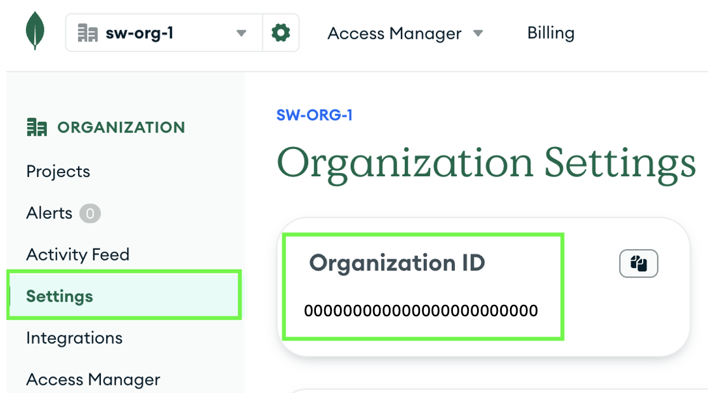

# Pipeline Deployment Guide

> **Note:** This repository provides two separate GitHub Actions pipelines for infrastructure deployment:
>
> - **Single-Region Pipeline:** `.github/workflows/ci-cd-infra-dev-single-region.yml`
> - **Multi-Region Pipeline:** `.github/workflows/ci-cd-infra-dev-multi-region.yml`
>
> Use the appropriate pipeline for your deployment scenario. The correct working directories and steps are handled automatically by each pipeline.

This guide explains how to deploy the infrastructure and application using the automated pipeline provided in this repository.

## Table of Contents

- [Overview](#overview)
- [Prerequisites](#prerequisites)
- [Pipeline Steps](#pipeline-steps)
- [Running the Pipeline](#running-the-pipeline)
- [Notes](#notes)

## Overview

The pipeline automates the sequential deployment of all Terraform steps, ensuring resources are provisioned in the correct order and with the required dependencies.

## Prerequisites

- **Step 0: DevOps (Manual Only) — Run First**
  - You must always run step 00-devops manually in `envs/dev/00-devops/` inside the respective single-region or multi-region folder before using the pipeline.
  - This step produces outputs (such as resource group, storage account, and optionally MongoDB Atlas org) that are required for configuring environment variables and subsequent steps.
  - Deploys:
    - Resource group for state and identity
    - Storage account for Terraform remote state
    - Federated identity and permissions for automation
    - Optionally, MongoDB Atlas Organization via Azure Marketplace (if enabled)
  - The pipeline does not run this step.
- After running step 0, configure all required environment variables in your pipeline environment using the outputs from step 0. See [Setup-environment.md](Setup-environment.md) for details.
- You must also create a GitHub environment named `dev` in your repository settings. See the [Creating a GitHub Environment](https://docs.github.com/en/actions/how-tos/deploy/configure-and-manage-deployments/manage-environments#creating-an-environment) documentation for instructions.

## Pipeline Steps

1. **Environment Setup**
   - Configure all required environment variables in your pipeline environment using the outputs from step 0.
   - See [Setup-environment.md](Setup-environment.md) for details.

2. **Base Infrastructure (Pipeline)**
   - Deploys from `envs/dev/01-base-infra/`:
     - Azure resource group for infrastructure
     - MongoDB Atlas project, cluster, and PrivateLink endpoint (using Atlas API)
     - Azure networking: VNet, private subnet, NAT gateway, public IP, network security group, and private endpoint for MongoDB Atlas
     - For multi-region deployments: VNet peering connections between regions
   - **Important:**
     - You must set your Atlas MongoDB organization id in the `org_id` variable and a custom name for the cluster in the `cluster_name` variable in the `locals.tf` file. You will find the org id in the organization's settings as shown below:
     
     - **You must commit and push the updated `org_id` and `cluster_name` values in `locals.tf` to your branch before running the pipeline, or the deployment will fail.**

3. **Application (Optional)**
   - Deploys from `envs/dev/02-app-resources/`:
     - Application resource group
     - App Service Plan
     - Virtual network and subnet for the app
     - Azure Web App (test app) with VNet integration
   - **Important:**
     - You must update `data.tf` in `envs/dev/02-app-resources/` to reference the correct resource group, storage account, and container values from Step 01.
     - **You must commit and push the updated `data.tf` file to your branch before running the pipeline, or the deployment will fail.**

4. **Testing Connectivity (Optional)**
   -You can deploy a web app (located in the `test-db-connection` folder) to test the connection to the database. For more information, see [Test_DB_connection_steps.md](Test_DB_connection_steps.md).

## Running the Pipeline

The pipeline can be triggered in two ways:

### 1. Automatic Trigger (Push to Main Branch)

When you push changes to the `main` branch that affect the relevant folders (such as `envs/dev/**` or `modules/**`), the pipeline will run automatically.

**How to apply changes automatically:**

- For base infrastructure: Commit and push changes to `envs/dev/01-base-infra/` or `modules/`.
- For application resources: Commit and push changes to `envs/dev/02-app-resources/`.
- The pipeline will detect changes and apply them as needed. No manual intervention is required.

### 2. Manual Trigger (Workflow Dispatch)

You can run the pipeline manually from the Actions tab in GitHub by selecting the workflow and clicking "Run workflow".

**How to apply changes manually:**

- In the workflow dispatch UI, you will see checkboxes with the following display text:
  - **Applies the plan for base infrastructure** (corresponds to `apply_base_infra`)
  - **Deploy test application infrastructure (Optional)** (corresponds to `deploy_test_db_app`)
- **You must check the appropriate options to actually apply the changes.**
  - If you do not check these options, the pipeline will only plan the changes and will not apply them.
  - For example:
    - Check **Applies the plan for base infrastructure** to apply changes to the base infrastructure.
    - Check **Deploy test application infrastructure (Optional)** to apply changes to the application resources (test app).

You can customize the workflow triggers and steps in `.github/workflows/ci-cd-infra-dev.yml`.

### Region Type Selection

There are two separate GitHub Actions workflows for deployments:

- **Single-Region Pipeline:**
  - Workflow file: `.github/workflows/ci-cd-infra-dev-single-region.yml`
  - Use for single-region deployments (resources in `templates/single-region/envs/dev/`).

- **Multi-Region Pipeline:**
  - Workflow file: `.github/workflows/ci-cd-infra-dev-multi-region.yml`
  - Use for multi-region deployments (resources in `templates/multi-region/envs/dev/`).

Select the workflow that matches your deployment requirements. Each pipeline automatically sets the correct working directory for Terraform steps.

## Notes

- If you need to re-run the pipeline, ensure that any required manual steps (such as creating API keys) have been completed and the environment variables are up to date.
- For troubleshooting and advanced configuration, refer to the comments in the pipeline YAML file.
