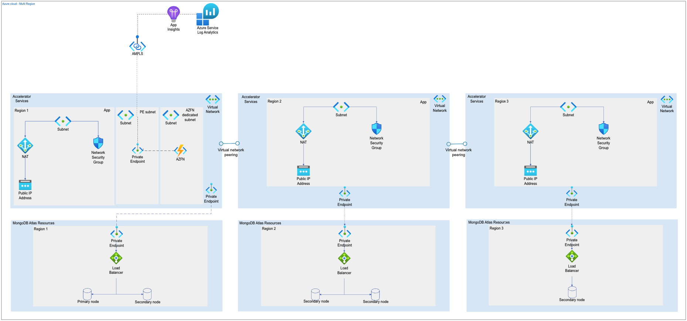

# Terraform Landing Zone for MongoDB Atlas on Azure

This repository provides a modular, production-ready Terraform solution for deploying a secure MongoDB Atlas environment on Azure, featuring private networking, DevOps automation, and end-to-end cluster setup.

---

## Disclaimer

> **Warning:** Deploying this infrastructure is **NOT free**. It includes paid resources such as a dedicated MongoDB Atlas cluster, networking resources, and various Azure services. Please review the associated costs carefully before running `terraform apply`. For more details, refer to the [MongoDB Atlas Private Endpoint documentation](https://www.mongodb.com/docs/atlas/security-private-endpoint/).
---

## Table of Contents

- [Features](#features)

- [Module Overview](#module-overview)
- [Architecture Overview](#architecture-overview)
- [Environments](#environments)
- [Prerequisites](#prerequisites)
- [Deployment Flow](#deployment-flow)
- [MongoDB Atlas: Sizing, Tiers, Regions, Pricing References and High availability configuration](#mongodb-atlas-sizing-tiers-regions-pricing-references-and-high-availability-configuration)
- [Documentation](#documentation)
- [License](#license)

---

## Features

- **DevOps Bootstrap:** Automates remote state, identity, and pipeline prerequisites setup.
- **Networking:** Provisions VNets, subnets, NAT gateway, and private endpoints for secure Atlas connectivity.
- **MongoDB Atlas Automation:** Deploys Atlas projects, clusters, and PrivateLink endpoints using the official provider.
- **Application Module:** Deploys a .NET sample app to Azure App Service with VNet integration for connectivity validation.
- **Marketplace Integration:** Optionally deploys an Atlas organization via Azure Marketplace using the `azapi` provider.

---

## Module Overview

For module-specific details, refer to [Modules.md](Modules.md):

- [Application](../../modules/application/readme.md): App Service Plan, Web App, and VNet integration.
- [DevOps](../../modules/devops/readme.md): Remote state, identity, and automation.
- [MongoDB Atlas Config Single Region](../../modules/atlas_config_single_region/readme.md): Atlas project, cluster, and PrivateLink.
- [MongoDB Atlas Config Multi Region](../../modules/atlas_config_multi_region/readme.md): Atlas project, cluster, and PrivateLink.
- [MongoDB Marketplace](../../modules/mongodb_marketplace/readme.md): Atlas org deployment via Azure Marketplace.
- [Network](../../modules/network/readme.md): VNet, subnets, NAT, NSG, and private endpoints.
- [VNet Peering](../../modules/vnet_peering/readme.md): Virtual network peering for multi-region connectivity.

---

## Architecture Overview

### Single-Region Deployment

### Multi-Region Deployment

---

## Environments

- **Development:** See `/envs/dev/` for example environment structure and guided configuration inside the respective single-region or multi-region folders.

---

## Prerequisites

Ensure you have completed all prerequisites before using this repository. Detailed instructions are available in [Prerequisites.md](Prerequisites.md).

---

## Deployment Flow

> **Important:** Step 0 (DevOps) must always be run manually before any other steps, even if you use the pipeline for subsequent steps. See [Manual Deployment Steps](Deploy-with-manual-steps.md) for details.
> **Tip:** Alternatively, you can use the automated pipelines for infrastructure and application deployment. See the [Pipeline Deployment Guide](Deploy-with-pipeline.md) and select the appropriate pipeline for your region type (single-region or multi-region).

This solution supports both single-region and multi-region deployments. Follow the flow that matches your scenario:

### Single-Region Deployment Flow

1. **Environment Setup**
   - Go to `templates/single-region/envs/dev/` and set the required environment variables before running any Terraform steps or pipelines.
   - See [Setup-environment.md](Setup-environment.md) for details.

2. **Step 0: DevOps (Manual)**
   - Go to `templates/single-region/envs/dev/00-devops/`.
   - This sets up backend storage and identity resources. Optionally, creates the Atlas organization.
   - See [Deploy-with-manual-steps.md](Deploy-with-manual-steps.md) for step-by-step guidance and Terraform commands.

3. **Provision Infrastructure and Application**
   - Go to `templates/single-region/envs/dev/01-base-infra/` and after completion, `templates/single-region/envs/dev/02-app-resources/`.
   - This provisions base infrastructure, configures MongoDB Atlas (single region), and deploys the sample application.
   - Refer to [Deploy-with-manual-steps.md](Deploy-with-manual-steps.md) for manual instructions and Terraform commands, or [Deploy-with-pipeline.md](Deploy-with-pipeline.md) for CI/CD pipeline usage.

4. **Testing Connectivity**
   - Use the provided .NET test app in `test-db-connection/test-pe-db-connection/` and follow [Database Connection Testing Guide](Test_DB_connection_steps.md) to verify connectivity.

5. **Testing Resilience**
   - After deployment and connectivity testing, validate the application's resilience to regional outages.
   - To simulate a regional outage and test failover, follow the official MongoDB Atlas guide: [Simulate a Regional Outage](https://www.mongodb.com/docs/atlas/tutorial/test-resilience/simulate-regional-outage/).
   - This ensures your cluster and application are configured for high availability and can recover from regional failures.

---

### Multi-Region Deployment Flow

1. **Environment Setup**
   - Go to `templates/multi-region/envs/dev/` and set the required environment variables before running any Terraform steps or pipelines.
   - See [Setup-environment.md](Setup-environment.md) for details.

2. **Step 0: DevOps (Manual)**
   - Go to `templates/multi-region/envs/dev/00-devops/`.
   - This sets up backend storage and identity resources. Optionally, create the Atlas organization.
   - See [Deploy-with-manual-steps.md](Deploy-with-manual-steps.md) for step-by-step guidance and Terraform commands.

3. **Provision Infrastructure and Application**
   - Go to `templates/multi-region/envs/dev/01-base-infra/` and then `templates/multi-region/envs/dev/02-app-resources/`.
   - This provisions base infrastructure, configures MongoDB Atlas (multi-region), VNet peering between regions, and deploys the sample application.
   - Refer to [Deploy-with-manual-steps.md](Deploy-with-manual-steps.md) for manual instructions and Terraform commands, or [Deploy-with-pipeline.md](Deploy-with-pipeline.md) for CI/CD pipeline usage.

4. **Testing Connectivity**
   - Use the provided .NET test app in `test-db-connection/test-pe-db-connection/` and follow [Database Connection Testing Guide](Test_DB_connection_steps.md) to verify connectivity across all configured regions.

5. **Testing Resilience**
   - After deployment and connectivity testing, validate the application's resilience to regional outages and failover scenarios.
   - To simulate a regional outage and test failover, follow the official MongoDB Atlas guide: [Simulate a Regional Outage](https://www.mongodb.com/docs/atlas/tutorial/test-resilience/simulate-regional-outage/).
   - This ensures your cluster and application are configured for high availability and can recover from regional failures.

## MongoDB Atlas: Sizing, Tiers, Regions, Pricing References and High availability configuration

### Choosing the right sizing and tier

For information on how to choose the right size and tier for the cluster, please refer to [Sizing and Tier Selection](https://www.mongodb.com/docs/atlas/sizing-tier-selection/) link in the Atlas documentation.

---

### Available tiers and supported regions

For information on available tiers and supported regions, please refer to [Azure Supported Tiers and Regions](https://www.mongodb.com/docs/atlas/reference/microsoft-azure/) link in the Atlas documentation.

---

### Private endpoint pricing

For information on private endpoint pricing, please refer to [Private Endpoint Pricing](https://www.mongodb.com/docs/atlas/billing/additional-services/#std-label-billing-private-endpoints-clusters) link in the Atlas documentation.

---

### High Availability

For production-grade high availability, MongoDB Atlas clusters should be deployed as a minimum 3-node replica set (one primary and two secondaries). This ensures:

- Automatic failover: If the primary node fails, Atlas automatically promotes a secondary to primary, minimizing downtime.
- Fault tolerance: The cluster can tolerate the loss of a single node without losing write availability.
- Data durability: Replication across nodes protects against data loss.

Atlas automatically distributes replica set members across availability zones within a region for additional resilience. For most workloads, a single-region, 3-node replica set is recommended.

**Important:** Always use an odd number of voting replica set members (3, 5, or 7) to ensure proper election and failover behavior.

For more information, see the [MongoDB Atlas High Availability documentation](https://www.mongodb.com/docs/atlas/architecture/current/high-availability/#recommended-deployment-topology-for-single-region).

---

## Documentation

- [Module Structure](Modules.md)
- [Environment Setup](Setup-environment.md)
- [Manual Deployment Steps](Deploy-with-manual-steps.md)
- [Pipeline Deployment Guide](Deploy-with-pipeline.md)
- [Database Connection Testing Guide](Test_DB_connection_steps.md)

---

## License

This project is licensed under the MIT License. See the [LICENSE](LICENSE) file for details.
