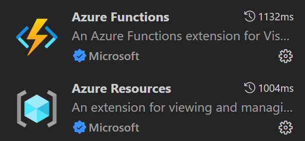
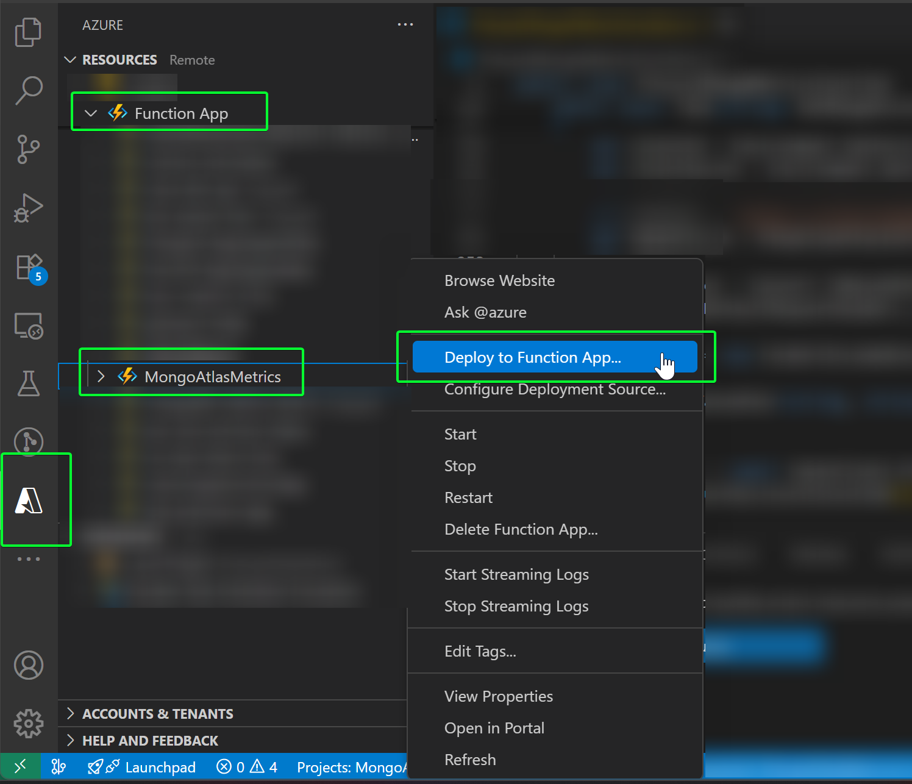

# MongoAtlasMetrics: Deployment Guide

## Overview

The `MongoAtlasMetrics` app is designed to collect metrics from MongoDB Atlas clusters using the [MongoDB API](https://www.mongodb.com/docs/api/doc/atlas-admin-api-v2/group/endpoint-monitoring-and-logs). This app integrates seamlessly with Azure environments and can be deployed as part of your cloud infrastructure. For a full list of the metrics this app gets from the MongoDB API, please refer to [Return Measurements for One MongoDB Process - m parameter](https://www.mongodb.com/docs/api/doc/atlas-admin-api-v2/operation/operation-getgroupprocessmeasurements#operation-getgroupprocessmeasurements-m)

## Prerequisites

Before deploying the `MongoAtlasMetrics` app, ensure the following prerequisites are met:

1. **Step 0 and Step 1 are successfully deployed**
2. **The following variables were set while deploying the step 1**:

- `MONGODB_CLIENT_ID`: Mandatory, this is the client ID of the MongoDB Service Account. Follow [these steps](#mongodb-service-account-creation) to generate the value.
- `MONGODB_CLIENT_SECRET`: Mandatory, this is the client secret of the MongoDB Service Account. Follow [these steps](#mongodb-service-account-creation) to generate the value.
- `MONGODB_GROUP_NAME`: Mandatory, this is the name of the MongoDB project
- `FUNCTION_FREQUENCY_CRON`: Optional, this is the frequency in CRON notation in which the Azure Function will be triggered. Default value is 1 hour.
- `MONGODB_INCLUDED_METRICS`: Optional, this is the list of metrics you want the Azure Function to log into the Application Insights resource. This expects a comma-separated string value. If provided, the exluded metrics are ignored.
- `MONGODB_EXCLUDED_METRICS`: Optional, this is the list of metrics you don't want the Azure Function to log into the Application Insights resource. This expects a comma-separated string value.

## Deployment Steps

### Deploy the MongoAtlasMetrics App Using Visual Studio Code

1. Open Visual Studio Code and open the folder where the Function App is: `MongoAtlasMetrics\MongoAtlasMetrics`.
1. Ensure **Azure Resources** and **Azure Function** extensions are installed, otherwise, install them.

    

1. Open the **Azure extension**, select your subscription > Function App, right-click your Function, and select **Deploy to Function App**.

    

1. The Function App will be deployed.

## MongoDB Service Account Creation

To generate the values for the `MONGODB_CLIENT_ID` and `MONGODB_CLIENT_SECRET` variables, you will need to create an organization-level service account. These values must be set prior to deploying step #1 so that everything is configured correctly.

**Recommended Approach:**  
MongoDB now provides official guidance for configuring API access at the organization level. Please follow the documentation here:  
[Configure API Access at the Organization Level](https://www.mongodb.com/docs/atlas/configure-api-access-org/)

**Summary of Steps:**

1. Visit the MongoDB Atlas portal.
2. Follow the steps outlined in the [official documentation](https://www.mongodb.com/docs/atlas/configure-api-access-org/) to create a service account and retrieve the API credentials.
3. When prompted, assign the appropriate permissions: `Organization Read Only`.
4. After creation, securely store your `Client ID` and `Client Secret` values.

> These credentials (`MONGODB_CLIENT_ID` and `MONGODB_CLIENT_SECRET`) are required for deploying the base infrastructure in step #1.
