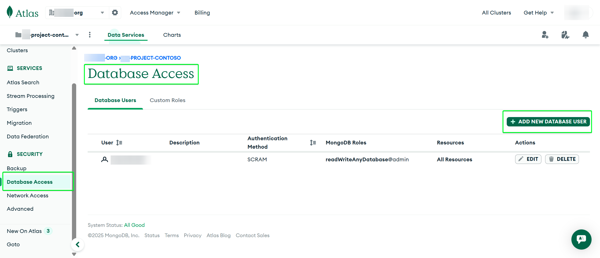
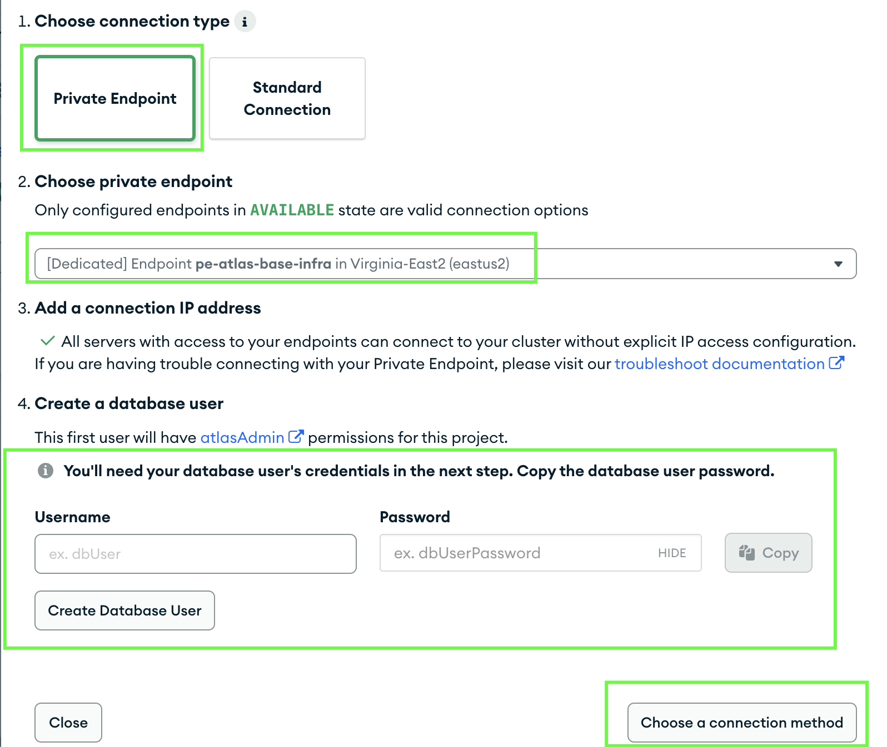
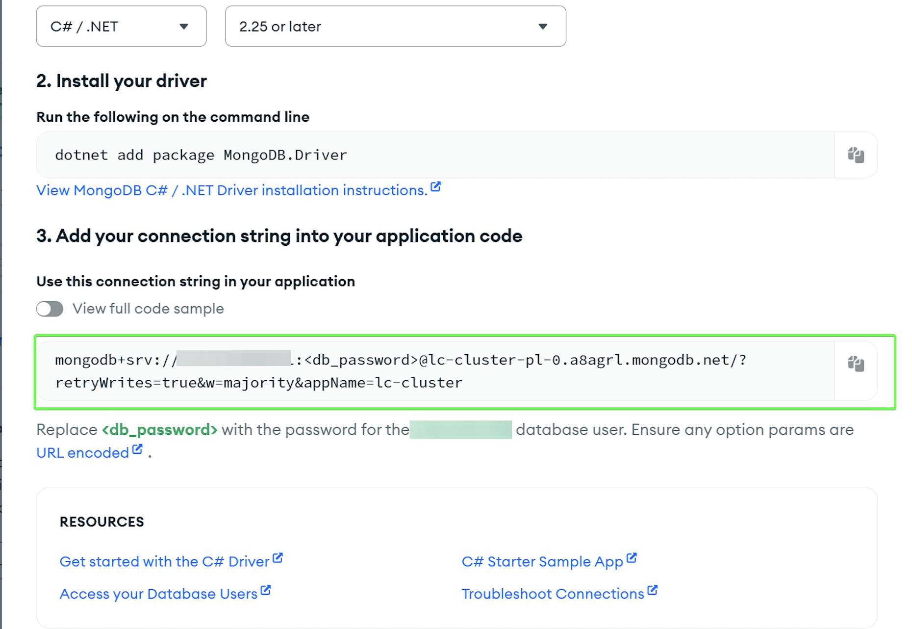
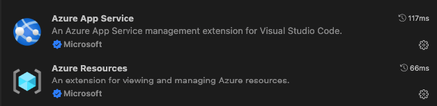
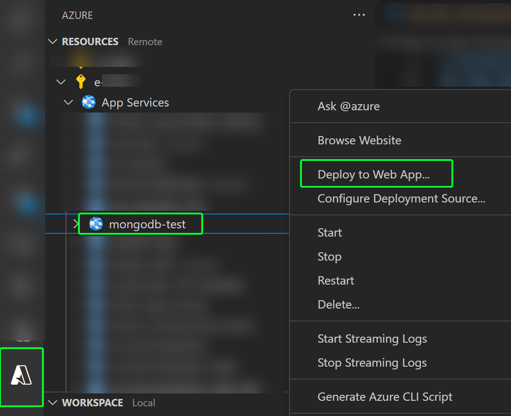
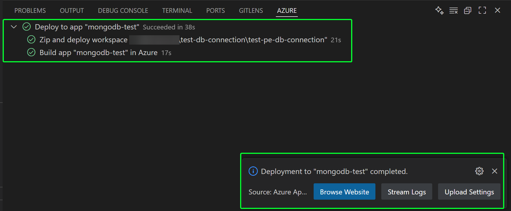
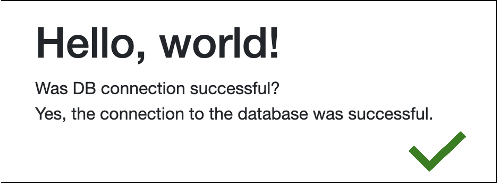
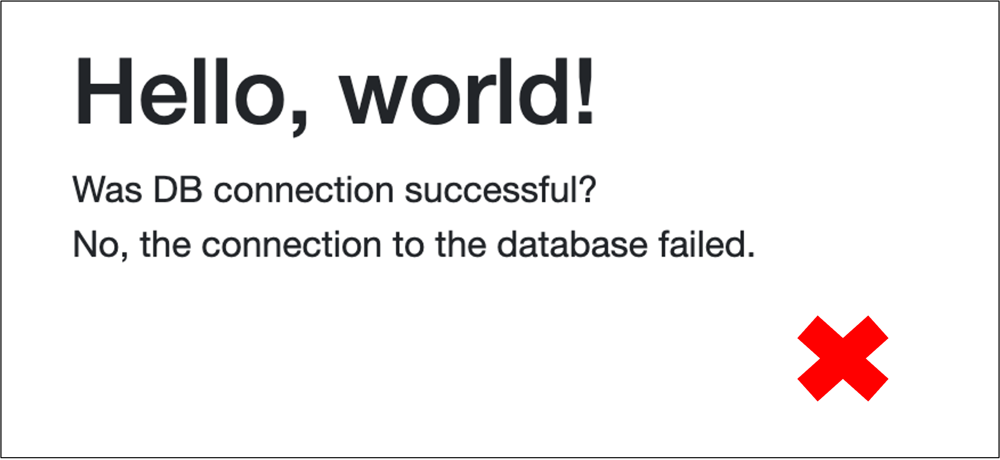

# Database Connection Testing Guide - Atlas MongoDB

This guide walks you through testing database connectivity against the **admin** database on an Atlas MongoDB cluster from Azure App Service.

---

## Table of Contents

- [Prerequisites](#prerequisites)
- [Step-by-Step Testing Process](#step-by-step-testing-process)
- [Troubleshooting](#troubleshooting)
- [Expected Results](#expected-results)
- [Security Considerations](#security-considerations)

---

## Prerequisites

- All resources in the `envs` folder have been created using Terraform.
- A database user exists in Atlas with access to the **admin** database on the target cluster.

---

## Step-by-Step Testing Process

### Multi-Region Note

For Multi-Region, repeat the steps for each region deployed.

### Before You Begin

Depending on your environment setup, follow the appropriate path:

**A. If the test application was already deployed in Step 3 (`02-application`) via the pipeline or manually:**

- **Skip steps 1 and 2** (creating/configuring the Web App and VNet integration).
- Start from [Step 3: Configure Connection String](#3-configure-connection-string) to set or update the connection string.
- Then move to [Step 4: Deploy the Test Application](#4-deploy-the-test-application-using-visual-studio-code) and [Step 5: Verify Connection](#5-verify-connection).

**B. If the test application was NOT deployed in Step 3 (`02-application`):**

- **Begin at [Step 1: Create an Azure Web App](#1-create-an-azure-web-app-not-needed-if-the-3rd-step-in-the-pipeline-was-ran)** and follow all steps sequentially.

> **Note:** Steps labeled "(Not needed if the 2nd step in the pipeline was ran)" can be skipped if your app was already deployed in `02-application`.

---

## 1. Create an Azure Web App (Not needed if the 3rd step in the pipeline was ran)

1. In the Azure Portal, create a new Web App in the same region and subscription as your infrastructure.
2. Choose an App Service Plan (Basic or higher is required for VNet integration).
3. Select the runtime stack matching the test application (e.g., .NET 8 LTS).

---

## 2. Connect Web App to VNet Subnet (Not needed if the 3rd step in the pipeline was ran)

**While creating the Web App:**

1. Navigate to the **Networking** tab.
2. Under **Virtual Network**, select the VNet connected to the Atlas private endpoint.
3. Under **Outbound access**, enable **VNet integration** and select the outbound subnet.
4. Complete resource creation.

**After the Web App is created:**

1. In the Web App, go to **Settings** > **Networking** > **Virtual Network Integration** (under Outbound traffic configuration).
2. Click the **Not configured** link.
3. Click **Add virtual network integration**.
4. Choose the correct subscription, VNet, and subnet.
5. Click **Connect**.

---

## 3. Configure Connection String

1. In the Atlas MongoDB portal, go to your cluster.
2. Navigate to **Connect** > **Private Endpoint**.
3. Create a database user if needed.

    

4. Select **Drivers** as the connection method.
5. Copy the private endpoint connection string.

    

6. In your Azure Web App, go to **Settings** > **Environment Variables**.
7. Add a new environment variable:
   - **Name:** `MONGODB_CONNECTION_STRING`
   - **Value:**  
     > ⚠️ **Paste the connection string from Atlas here, and be sure to replace `<db_password>` with the actual password for your database user.**
8. Save the configuration.

[Back to Table of Steps](#step-by-step-testing-process)

---

## 4. Deploy the Test Application Using Visual Studio Code

1. Run `dotnet publish -c Release -o ./bin/Publish` in the `test-db-connection/test-pe-db-connection/test-db-connection/` directory.
2. Open Visual Studio Code.
3. Ensure **Azure Resources** and **Azure App Service** extensions are installed, otherwise, install them.

    

4. Open the **Azure extension**, select your subscription > App Services, right-click your Web App, and select **Deploy to Web App**.

    

5. Deploy from the folder: `test-db-connection/test-pe-db-connection/test-pe-db-connection/bin/Publish`.
6. The Web App will be deployed.

---

## 5. Verify Connection

1. Go to your Web App URL.
2. The test application will attempt to connect to the MongoDB **admin** database.
3. If successful, you will see:

If unsuccessful, you will see:

---

## Troubleshooting

### Common Issues

#### Connection Timeout

- Verify VNet integration is correct.
- Check Network Security Group rules.
- Ensure the private endpoint is accessible from the App Service VNet.

#### Authentication Errors

- Ensure the MongoDB connection string has valid credentials.
- Check that the MongoDB user has permission to access the **admin** database.

---

## Expected Results

If set up correctly, the test app will connect to the Atlas MongoDB cluster via the private endpoint and display a success message. If not, review the [Troubleshooting](#troubleshooting) section.

---

## Security Considerations

- Connection strings are sensitive. Always store them securely in your App Service configuration. Never expose them in code or logs.
